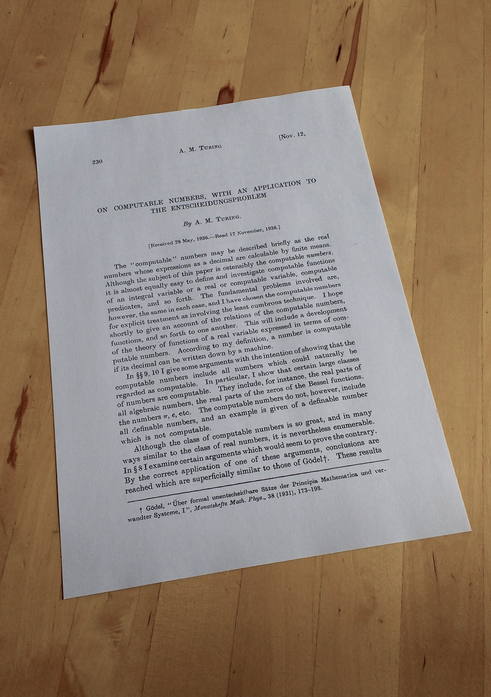
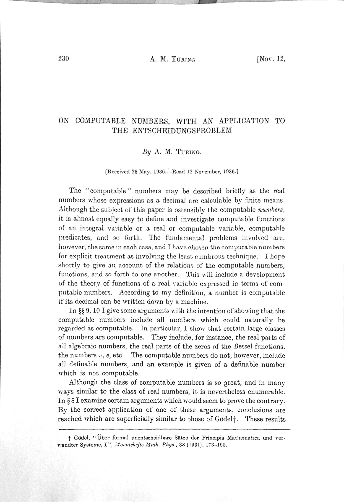

# Perspector

Perspector is a simple python script to scan documents based on opencv. It finds the white sheet in a photo and fixes the perspective. See the example below and try it yourself.

⚠️ Bugs included! (this is an experiment)

### Demo

| Before                           | After                           |
| -------------------------------- | ------------------------------- |
|  |  |

***

*Made with* 🍷 *in Torino.*
